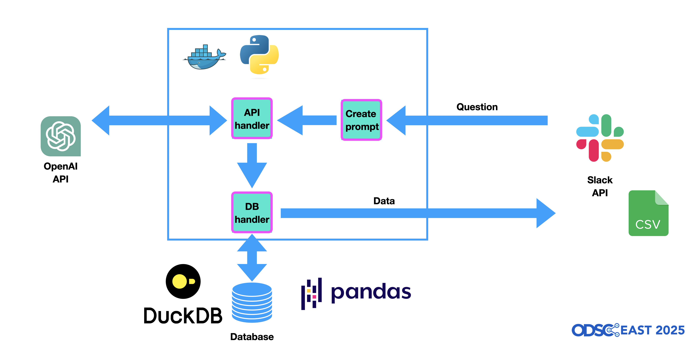
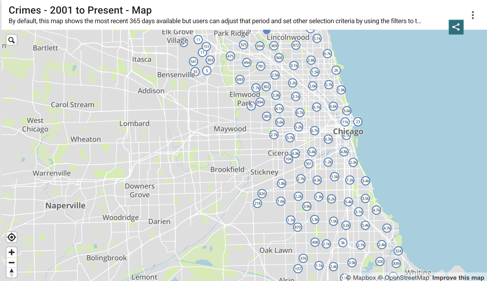
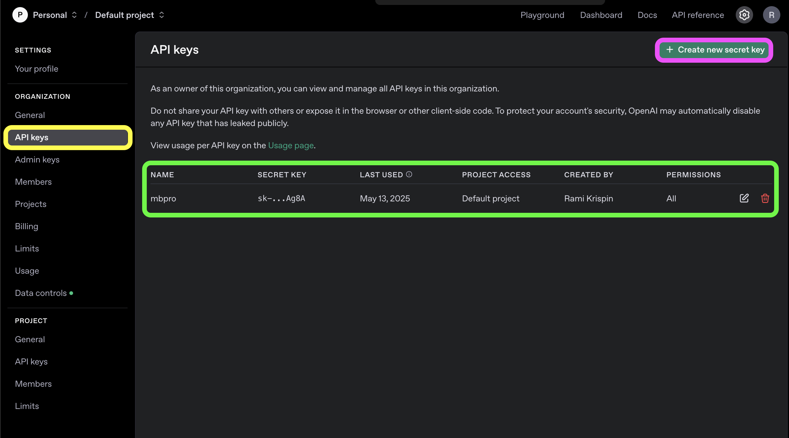
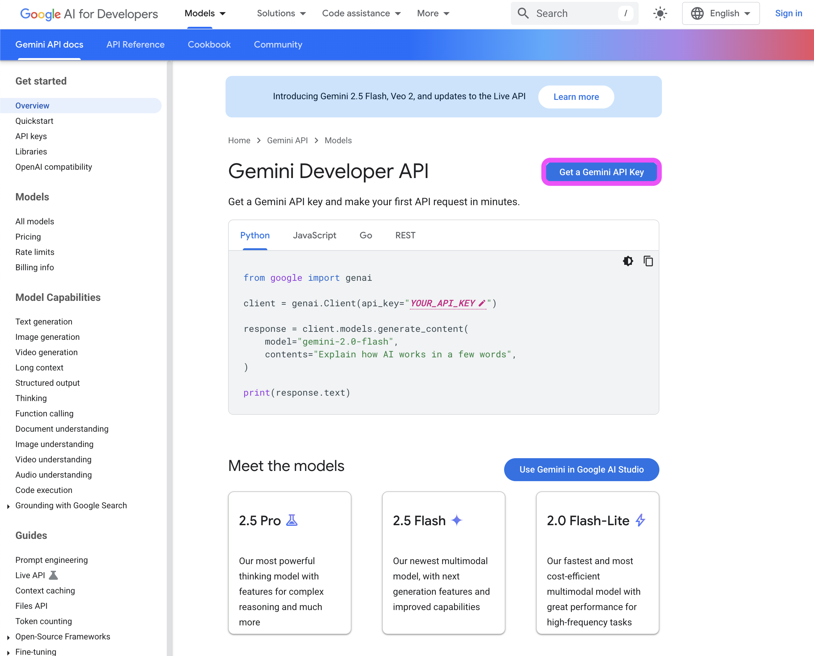
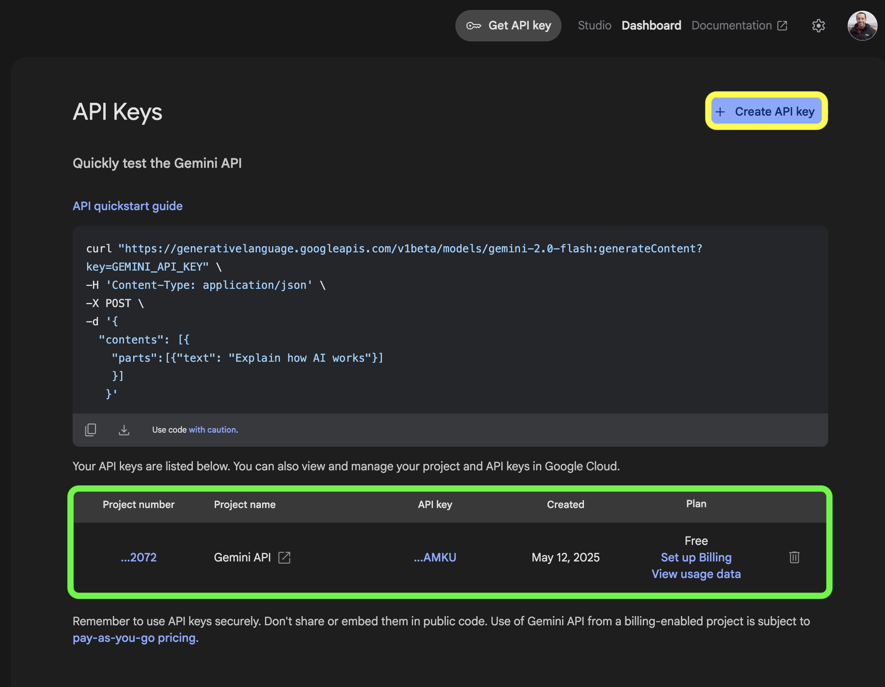

# Using LLM to Query Data

Materials for the "Using LLM to Query Data" workshop at the ODSC 2025 conference. 

<figure>
 </a>
<figcaption> Boston 3D map (created with Midjourney)</figcaption>
</figure>

<br>
<br />

Session info: https://odsc.com/speakers/using-llm-to-query-data/

When 📆: May 15, 2025, at 2:00 PM EDT

## Agenda

This workshop focuses on how to use LLMs to query data.. We will demonstrate how to use OpenAI's GPT-4.1 model and Gemini's API to translate natural language into SQL queries. We will also demonstrate how to use the `duckdb` library to query the data using SQL queries.


<figure>
 </a>
<figcaption> The agent architecture </figcaption>
</figure>

<br>
<br />

To demonstrate the process, we will use the Chicago Crime dataset we pulled earlier from the API and load it into a Pandas dataframe. We will also use the `duckdb` library to query the data using SQL queries.

<figure>
 </a>
<figcaption> The Chicago Crime dataset </figcaption>
</figure>

<br>
<br />

## Prerequisites

To follow along, you need a few things: 
- Set up a Python environment with the required libraries (see below)
- Set up the API keys, we will demonstrate using the OpenAI and Gemini APIs (you can choose one or both)


You will need to set up your Python virtual environment to follow along with the workshop materials. You can either set a virtual environment using your preferred method (venv, uv, conda, etc.) or use Docker.

### Python Environment

The workshop environment is available on the [requirements.txt](https://github.com/RamiKrispin/osdc-2025-llm-workshop/blob/main/docker/requirements.txt) file under the `docker` folder. You can set your own virtual environment or use Docker. Below are examples for setting up a Python virtual environment with uv or Docker.

#### Virtual Environment

The workshop environment is available on the [requirements.txt](https://github.com/RamiKrispin/osdc-2025-llm-workshop/blob/main/docker/requirements.txt) file under the `docker` folder. 

Here is how you can set your virtual environment with uv. This required uv to be installed. 
```shell
uv venv --python 3.11
```

We will activate the the virtual environment and install all the dependencies for this workshop:

```shell
source .venv/bin/activate
uv pip install  --no-cache-dir -r docker/requirements.txt
```

You can validate if the process was completed successfully by running the `uv pip list` command:

```shell
uv pip list                                                                      
Package                   Version
------------------------- --------------
annotated-types           0.7.0
anyio                     4.9.0
appnope                   0.1.4
argon2-cffi               23.1.0
argon2-cffi-bindings      21.2.0
arrow                     1.3.0
asttokens                 3.0.0
async-lru                 2.0.5
attrs                     25.3.0
babel                     2.17.0
...
...
urllib3                   2.4.0
wcwidth                   0.2.13
webcolors                 24.11.1
webencodings              0.5.1
websocket-client          1.8.0
wheel                     0.45.1
widgetsnbextension        4.0.14
zipp                      3.21.0

```

### Docker + VSCode

Alternatively, you can use the workshop's image which contains all of the dependencies and is ready to go:
```shell
docker.io/rkrispin/python-odsc-2025:arm64.0.0.1
```

As you can noticed from the image label, it supports arm64 architecture. If you are using a different architecture, you can simply rebuild the image by running:

```shell
bash build_docker.sh
```

You will need to modify the `user_name` variable in the bash script to your Docker Hub username (if you want to push it to Docker Hub).

If you are using VScode, I recommend using the VScode Dev Containers extension with the default container configuration.settings as defined in `.devcontainer/devcontainer.json`.


## Setting Up API Keys 

Throughout this workshop, we will demonstrate the process of auto generating queries using the OpenAI and Gemini APIs. Note that the OpenAI API requires a paid subscription to use it, and the Gemini API offers free access to some models.

### Setting up OpenAI API Key

To use the OpenAI API, you will have to create an account, register to the API and setup your own key. To register to the API go the [OpenAI API main page](https://platform.openai.com/settings/organization/api-keys), and select the "API Keys" on the left menu (marked in yellow)  and click the Create new secret key button on the top right corner (marked in purple):
<figure>
 </a>
<figcaption> Creating a new API key </figcaption>
</figure>

<br>
<br />

You can see in the button of this page the list of existing API keys (marked in green).

You should store the API key as an environment variable (for macOS and Linux) by adding the following line to your code to your `zshrc` or `bashrc` file:

```bash
export OPENAI_API_KEY="your_api_key"
```
<br>
<br />

### Setting up Google Gemini API Key

To use the Gemini API, you will have to register to the API and setup your own key. To register to the API go the [Gemini Developer API main page](https://ai.google.dev/gemini-api/docs), and click on the "Get a Gemini API Key" button on the top right corner (marked in purple):

<figure>
 </a>
<figcaption> The Gemini Developer API page </figcaption>
</figure>

<br>
<br />

If you already have a Google account it will direct you to the API Key page, where you can create keys (marked in yellow):
<figure>
 </a>
<figcaption> Creating a new API key </figcaption>
</figure>

<br>
<br />
You can see in the button of this page the list of existing API keys. Note that we are using a free plan, therefore, we will be limited in the type of models that we can use.


You should store the API key as an environment variable (for macOS and Linux) by adding the following line to your code to your `zshrc` or `bashrc` file:

```bash
export GEMINI_API_KEY="your_api_key"
```

## Notebooks

We will use the following Jupyter notebooks:
- Data preparation: [01_data_load.ipynb](https://github.com/RamiKrispin/osdc-2025-llm-workshop/blob/main/01_data_load.ipynb)
- SQL generator with the OpenAI API: [02_sql_generator_openai.ipynb](https://github.com/RamiKrispin/osdc-2025-llm-workshop/blob/main/02_sql_generator_openai.ipynb)
- SQL generator with the Gemini API: [03_sql_generator_gemini.ipynb](https://github.com/RamiKrispin/osdc-2025-llm-workshop/blob/main/03_sql_generator_gemini.ipynb)


